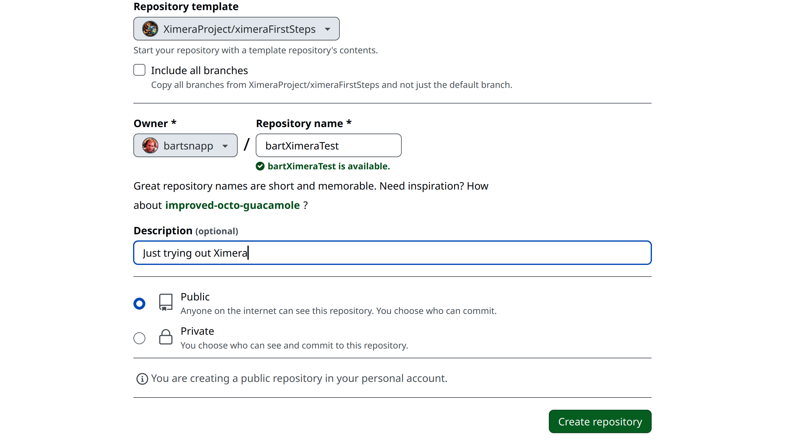
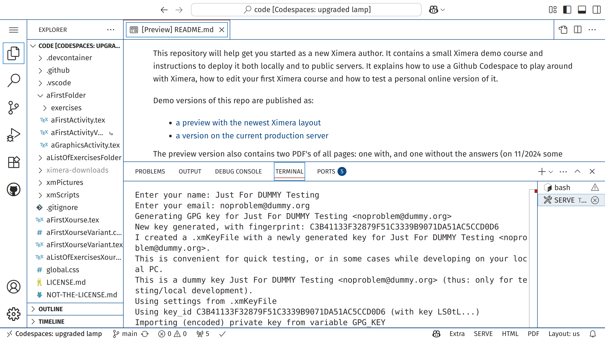
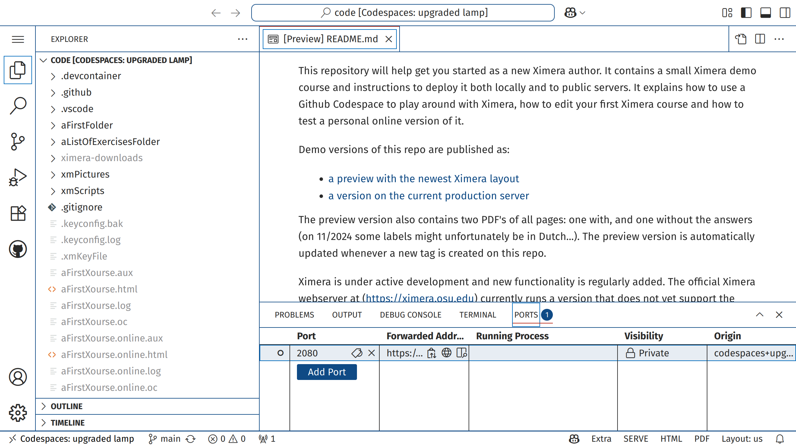

This repository will help get you started as a new Ximera author. It contains a small Ximera demo course and instructions to deploy it both locally and to public servers. 
It explains how to use a Github Codespace to play around with Ximera, how to edit your first Ximera course and how to test a personal online version of it.

Demo versions of this repo are published as:

- [a preview with the newest Ximera layout](https://set-p-dsb-zomercursus-latest.cloud-ext.icts.kuleuven.be/firststeps/aFirstXourseVariant/aFirstFolder/aFirstActivityVariant)
- [a version on the current production server](https://ximera.osu.edu/firststeps24/aFirstXourse/aFirstFolder/aFirstActivity)

The preview version also contains two PDF's of all pages: one with, and one without the answers (on 11/2024 some labels might unfortunately be in Dutch...).
The preview version is automatically updated whenever a new tag is created on this repo.

Ximera is under active development and new functionality is regularly added. The official Ximera webserver at https://ximera.osu.edu currently runs a version that does not yet support the newest features, and in particular not the newer layout that is available for local testing and at the KU Leuven servers. This is expected to change soon.

In case of problems, please submit an issue on the "Issues" tab at [ximeraFirstSteps](https://github.com/XimeraProject/ximeraFirstSteps).

For additional help, the [Ximera User Manual](https://github.com/XimeraProject/ximeraManuals/releases/download/v1.5.0/ximeraUserManual.pdf) may help and we also encourage you to contact the Ximera developers at: ximera@math.osu.edu

# Use Github Codespaces to play around with Ximera, without any further setup.

To author using Ximera, you must have a GitHub account. 

## Create your own repository from our template

Log into GitHub and go to this (the one you are currently at) repo: [ximeraFirstSteps](https://github.com/XimeraProject/ximeraFirstSteps). Click on the green "Use this template" button and select "Create a new repository." **Give it a fun repository name**, and push the button "Create repository." At this point you have your own personal copy of our repository `ximeraFirstSteps`. In fact, after you create it, GitHub will take you to it.

## Start a Codespace

When at your repository, click the green "Code" button, select the "Codespaces"
tab, and click ``Create codespace on main.'' A GitHub codespace is a remote computer set up specifically for coding. 
- GitHub notifies you (somewhat inconspicuously, it might have been under the button you just pressed) that **you** will pay for the codespace. You can **ignore this warning** as the first 120 hours per month are free, and you should not spend 120 hours playing around with Ximera anyway.
  
**The first time a Codespace is created, it will take around 5 minutes for your codespace to be created and you must wait until it is complete**. Subsequent starts of the codespace will be much faster. We have our codespace preconfigured with all the tools, libraries, and software you need to use Ximera. With a codespace, you can instantly start working without worrying about setting up software on your local machine. Moreover, **Ximera developers** can go to your GitHub page, start their own codespace, and try out your code and directly help with possible issues.

## In the  Codespace

Once the codespace is created, you will see something like this:

This is Visual Studio Code (VS Code) running within your browser. VS Code
is a powerful text-editor with many extensions. We use it write Ximera content.
On the far left, you see a vertical list of icons. Currently, "EXPLORER" is
selected, it looks like "pages of paper." Moving right, we see the files in
our GitHub repository. At the bottom right-hand corner of the screen you will see
buttons that say "SERVE,"  "HTML," and "PDF."
- The "SERVE" button compiles the **entire** Ximera repository to HTML and deploys to a (local or remote) server. If this is the first time you are compiling, it will take a few minutes.
- The "HTML" button compiles only the **current** LaTeX file to HTML.
- The "PDF" button compiles only the **current** LaTeX file to PDF using our Ximera tools.

At this point, you will want to press the "SERVE" button. This will
compile the entire repository and deploy it to a local server. As part of this process, we will generate a GPG Key, that we use to help sign content online. 
If you are simply playing with Ximera, you can just hit "enter" **twice**.

After you have pressed the "SERVE" button (the first time it will take a few minutes to compile the demo course) you will see a "terminal" window at the bottom of the screen. Note the line that says: "PROBLEMS," "OUTPUT," "DEBUG CONSOLE," "TERMINAL," "PORTS." You want to click on "PORTS." The "PORTS" tab may be hidden within "..."

After you click on "PORTS," select 2080 and click on the globe, and a webpage
will open. Your content will be under the link "Content." You should be able to see the content in your browser.

## Make some changes and redeploy

Within VS Code (running in the codespace) press `CTRL-P` to open a file, type 'AFirstA' to see that the file aFirstActivity.tex is shown. Press enter to open it, change the `\title` around line 11 to e.g. `A VERY basic activity`, press `CTRL-S` to save, and hit `SERVE` again. After a few seconds, an orange `Update` button will appear on the page in the Ximera course, and after pushing it, the title will be updated. 
- Play around changing other things in the activities, push SERVE, and look at the results.
- Be impressed. Decide to look further into this and to write your own content. Contact us.

As Ximera is under active development, some things might not be as smooth as suggested here, and some things might change quickly. Do not hesitate to contact us. 
The current production site has been used since 2016 for hundreds of courses by many thousands of students. These courses will continue to work unchanged in the new version, with an updated layout. 
New functionality will become available for new or updated courses.

#  Next steps if you liked what you saw

At this point, authors should check out the [Ximera User Manual](https://github.com/XimeraProject/ximeraManuals/releases/download/v1.5.0/ximeraUserManual.pdf), and/or contact Ximera developers for assistance at: ximera@math.osu.edu

## Use Github Codespaces for further experimenting with Ximera

If you decide to make your own **new** Ximera content, it is better to create a new repo using [ximeraNewProject](https://github.com/XimeraProject/ximeraNewProject) as a **Template**. There should be a large green "Use this template" button near the top-right of that page. You could also start a **Template** from this [ximeraFirstSteps](https://github.com/XimeraProject/ximeraFirstSteps) repo, which contains some more demo files.

## Upgrade an existing repository

If you already have a repo with a Ximera course, you can 
copy the following files and folders from [this repo](https://github.com/XimeraProject/ximeraNewProject) to your repo:

- `xmScripts/`     (this folder contains the `xmlatex` script that builds the Ximera courses) 
- `.gitignore` (keeps your repository clean)
- `.vscode/`       (for our VS Code buttons)
- `.devcontainer/` (enables the codespace to run)
- `global.css` (applies some styling to the webpage)

If a `.gitignore` file already exists in your repo, we suggest you replace it with ours or at least check for differences. Note: **never** push the file `.xmKeyFile` with your own key.

## Developing on your own PC

If you prefer to work locally on your own PC, it is strongly advised to use Docker as explained [here](README_localsetup.md).

